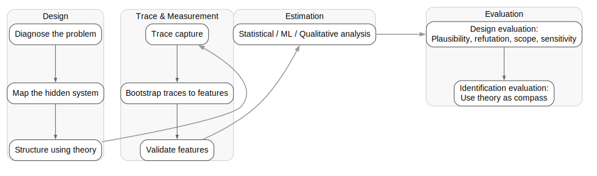

# PRISM Working Draft
*A framework for inference under adversarial data-generation processes and for processes that resist direct observation.*

---

## Overview

The PRISM (Partial-Observation Inference & Structured Measurement) approach emerges from my research on conducting inference in domains where the ground truth is fundamentally unknowable or unattainable. This site documents and builds the methodological approach that I developed across multiple projects and extends and formalizes it for future users. 

Through this page, I build a strategy to address the challenge of generating and validating conclusions about the world when one can't observe ground truth. I look to tools and  machine learning — such as ensemble methods and evaluation in the absence of ground truth —and to design frameworks from the causal inference tradition.

Through PRISM, I aim to contribute a methodological framework for reasoning under partial observability and strategic opacity. This project aims to provide a structured workflow for designing, measuring, and inferring when key mechanisms are hidden by design or data are adversarially generated.

I build on existing and insightful work at the intersection of computational social science, machine learning, and substantive domain expertise

It unites three traditions:

- **Research design flow** from qualitative social science  
- **Causal-inference logic** from econometrics and statistics  
- **Measurement and representation learning** from computational social science and applied machine learning  

PRISM’s goal is to help researchers design defensible estimation and inference strategies in hard-to-measure domains.

The core is a **Design → Trace & Measurement → Estimation & Inference → Evaluation** workflow.  
This flow anchors inference within empirical social-science and ML architectures while acknowledging that work in opaque systems often requires bespoke, indirect features and theory-centered judgment.

## Core Process Flow

The schematic below outlines the PRISM design sequence.

  

Formally, PRISM models inference as:

$T \rightarrow \hat{Z} \rightarrow Y$

where **T** are observed traces, **Ẑ** represents latent or hidden mechanisms, and **Y** is the outcome of interest.  

The framework provides a structured pathway for converting partial and strategically obscured traces (**T**) into defensible inferences about hidden mechanisms (**Ẑ**) and their consequences (**Y**).

---

## Explore the Framework

- [**Design**](Design/overview.md)  
- [**Trace & Measurement**](Measurement-Trace/overview.md)  
- [**Estimation & Inference**](Estimation/overview.md)  
- [**Evaluation**](Evaluation/overview.md)  

### Wider Context
- [Scope Conditions](framework/scope_conditions.md)  
- [Intellectual Lineage and Related Work](framework/related_work.md)

---

## Why PRISM?

- Provides a structured design pattern for inference under opaque conditions, such as where data are absent or adversarial  
- Bridges social-science theory, qualitative designs, and machine-learning formalism, enabling theory-driven yet scalable workflows  
- Suggests pathways to generate testable hypotheses and quantitative metrics in opaque domains  

## When to use PRISM:
PRISM is most valuable for research questions that involve strategic concealment or structural unavailability when the phenomenon doesn't leave direct traces, and when one wants to:

- Test theoretical mechanisms rather than just document patterns
- Make systematic claims when key mechanisms are hidden or when observability varies by actors or across time
- Use causal inference tools without the generous data environment assumed by standard identification strategies
- Defend a research design to audiences expecting rigorous identification strategies

## Who is PRISM for?

The PRISM framework provides a design approach for researchers working on strategically concealed or structurally unobservable processes. It's designed to help organize research design decisions and connect work to established traditions in causal inference and qualitative methods. 

Example users include:
- Researchers studying militant operations, sanctions evasion, informal economies, or other domains with strategic concealment
- Teams designing projects where standard data availability assumptions don't hold
- Analysts working on opaque domains, such as supply chain vulnerabilities and regulatory evasion.

PRISM is most valuable:

- At the early stages of research design, when thinking systematically about what is and is not observable
- For positioning research on opaque systems relative to the expectations in causal inference and qualitative communities
  
Primary audiences:

- Security and conflict researchers studying militant group operations, clandestine state programs, or terrorism
- Supply chain and economic analysts investigating sanctions evasion, informal economies, or strategic vulnerabilities in critical materials
- Computational social scientists bridging causal inference standards and measurement techniques available for hard-to-capture domains
- Analysts working in domains where ground truth is systematically hidden

---

## Resources

- **Whitepaper (PDF)** — *Coming Soon: Conceptual and technical foundations*  
- **Examples**
    - [Growth Trap](examples/growth_trap.md): Demonstrates how the PRISM framework operationalizes indirect research design in hostile data environments via computational approaches to measurement, triangulation and structured evaluation, and human-in-the-loop domain and theoretical knowledge.
    - [Subject to Change](examples/subject_to_change.md) Full PRISM Design, Trace and Measurement, Inference and Estimation, and Evaluation workflow in the context of designing an approach to capture a dually opaque process (an abstract idea, organizational change, in a concealed space, militant groups) at scale and with robust statistical inference about downstream outcomes.
   <!-- (UNCOMMENT WHEN MORE DEVELOPED- [Alternative Hubs](examples/alternative_hubs.md). Example of a partial PRISM flow focused on the Design, Trace, and Measurement steps as part of an ongoing line of research on identifying non-obvious sources of lock-in and vulnerability in critical materials supply chains. --> 

---

## Status

Version 0.9 (November 2025): Working framework with 4-step workflow, diagnostic questions, and connections to established methodological traditions. 

This version provides the conceptual structure and initial seed examples.
Future iterations plan to complete the citations and literature connections, add operational tools, and extend the examples beyond conflict.
Contact: [m.jenkins.foster@gmail.com]

## Citation

If you use or adapt this framework, please cite:

> **Foster, Margaret. J. (2025).** *Inference Under Opacity: The PRISM Framework v1.0.*  
> [https://margaretfoster.github.io/PRISM-framework](https://margaretfoster.github.io/PRISM-framework)
---

<!-- MathJax for LaTeX rendering -->

© 2025 Margaret J. Foster · Released under [CC BY 4.0](https://creativecommons.org/licenses/by/4.0/) · View on [GitHub](https://github.com/margaretfoster/PRISM-framework)
