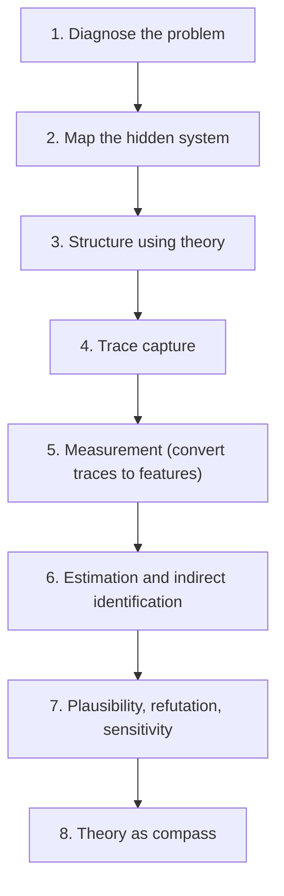

# The PRISM Framework v1.0  
**Inference under Opacity**

_Designing defensible inference and measurement in negative spaces: adversarial, hidden, and strategically opaque systems._

---

### Overview

**PRISM** is a methodological framework for inference when the structure of the world is only partially observable, such as when actors, institutions, or technical systems deliberately conceal evidence of the mechanisms or processes that we want to understand.  

The framework emerges from computational social science work on clandestine organizational structures. It brings together research design flow from qualitative social science, structure from causal inference logic, and the measurement tools of computational social science. The end goal is to help researchers design rigorous estimation and inferential approaches in hard-to-measure domains. 

Core to the framework is a **trace → measurement → inference** workflow.

As a framework, PRISM unifies similar methodological and substantive efforts across applied social science, computational social science, and applied machine learning.

PRISM bridges mainstream research-design frameworks with hostile data environments and is intended as a tool for scholars and practitioners working in domains where key mechanisms are strategically concealed or structurally unobservable.

---
## Core Process Flow:

---

### Why PRISM?

- PRISM provies a tool menu and workflow to structure design for inference in _negative spaces_ where data is absent 
- It bridges social-science theory, qualitative epistemology, and machine-learning formalism, so that researchers can develop project scaffolding using all three as supports.
- It suggests avenues to generate testable hypotheses and quantitative metrics in opaque domains
- It is designed to grow through engagement and be extended through open notebooks, examples, modular code, and whitepapers

---

### Resources

- [**Whitepaper (PDF)**]() — Coming soon: conceptual and technical foundations 
- [**Examples**](examples/) — Coming soon: 
---

### Citation

If you use or adapt this framework, please cite:

> **Foster, M. J. (2025).** *Inference under Opacity: The PRISM Framework v1.0.*  
> [https://margaretfoster.github.io/inference-under-opacity](https://margaretfoster.github.io/inference-under-opacity)

---

### Contact

For collaboration or feedback:  
[m.jenkins.foster@gmail.com](mailto:m.jenkins.foster@gmail.com)

---

© 2025 Margaret J. Foster · Released under [CC BY 4.0](https://creativecommons.org/licenses/by/4.0/)  
